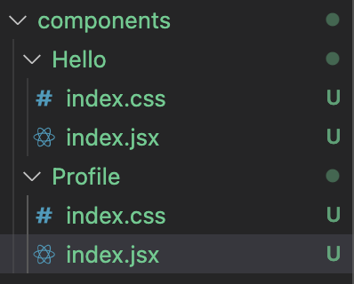

### 其他

vscode中jsx语法标签自动闭合：

```json
{
  "emmet.includeLanguages": {
    "wxml": "html",
    "javascript": "javascriptreact"
  },
}
```

### 1.react是什么？

> 用于构建用户界面的JavsScript库

原生js操作dom的问题？

- 原生js操作dom繁琐，效率低(使用dom-api操作ui)
- 使用原生js操作dom，浏览器会进行大量的重绘重排
- 原生js没有组件化的编码方案，代码复用率低

### 2.特点

1. 采用**组件化**模式、**声明式编码**，提高开发效率和组件复用率

   > 声明式编码：一个简单的命令，react内部就会帮助我们完成某些操作

2. 在ReactNative中可以使用React语法进行**移动端开发**

3. 使用**虚拟DOM**+优秀的**Diffing算法**，尽量减少与真实DOM的交互

4. react高效的原因？

   - 使用虚拟dom，不直接对操作页面的真是dom
   - dom diffing算法，最小化页面重绘

### 3.基本使用

#### 3.1引入相关库

1. react.js

2. react-dom  react扩展库

3. babel.min.js  下载地址：  https://github.com/babel/babel-standalone/releases

   作用：

   > 1. es6 => es5
   > 2. jsx => js

   ```html
   <script src="./static/babel.min.js"></script>
     <!-- 核心库 -->
   <script src="./static/react.development.js"></script>
   <!-- 用于react支持dom操作 -->
   <script src="./static/react-dom.development.js"></script>
   
   <script type="text/babel">
     // 此处 不要加引号
       const VDOM = <h1>hello react</h1>
       ReactDOM.render(VDOM, document.getElementById('app'))
   </script>
   ```

   jsx语法

   ```js
   // 此处 不要加引号
   const VDOM = <h1>hello react</h1>
   ReactDOM.render(VDOM, document.getElementById('app'))
   ```

   虚拟dom：

   1. 本质就是Object类型的对象
   2. 虚拟dom比较轻，真实dom比较重，因为虚拟dom是react内部在用，无需真实dom上的那么多属性。
   3. 虚拟dom最终会被react转化为真实dom，呈现在页面上

#### 3.1 JSX

- 全称 Javascript XML

- react定义的一种类似于XML的js扩展语法：js+XML

  > XML:早期用于存储和传输数据

  ```xml
  <student>
    <name>Jack</name>
    <age>18</age>
  </student>
  ```

  后来使用json来存储：js自身的parse stringify两个方法。
  
  ```json
  {
    "name": "Jack",
    "age": 18
  }
  ```
  
- 本质是React.createElement(tag, props,...children)方法的语法糖

- jsx的语法规则：

  - 定义虚拟dom时，不要加引号
  - 标签中混入js表达式时要加{}
  - 样式的类名不要用class，要用className
  - 内联样式要用对象的写法 `style={{color: 'red'}}`
  - 只有一个根标签
  - 标签必须闭合
  - 标签首字母
    - 小写字母：将标签转化为html同名元素，若html中无该标签对应的同名标签，则报错
    - 大写：react就去渲染对应的组件，若无则报错

  ```jsx
  const VDOM = (<div>
      <h1 id="main">hello react</h1>
      <h3 className="red">我是H3标签</h3>
      <h4 style={{color: 'red', backgroundColor: '#ccc'}}>基本信息：{name}</h4>
    </div>)
  ```

  **{}**混入表达式不报错，js语句(代码)就会报错
  
  表达式：一个表达式可以产生一个值，可以放在任何需要的地方
  
  - a (一个变量)
  
  - a + b
  
  - func(1)
  
  - arr.map
  
  - function fn(){}
  
    > let xxx = 表达式  有一个返回值，就是表达式
  
  语句(代码)
  
  - if(){}
  - for(){}
  - switch() {case:xx}

#### 3.2模块化、组件

##### 3.2.1模块

1. 理解：向外提供特定功能的js程序，一般就是一个js文件
2. 为什么要拆成模块：随着业务逻辑增加，代码越来越多且复杂
3. 作用：复用js，简化js的编写，提高js运行效率

##### 3.2.2组件

1. 理解：用来实现局部功能效果的代码和资源的集合(html/css/js/image)
2. 为什么：一个界面的功能更复杂
3. 作用：**复用代码**，简化项目编码，提高运行效率

##### 3.2.3模块化

​	当应用的js都以模块来编写，这个应用就是模块化的应用

##### 3.2.4组件化

​	当应用以多组件的方式实现，这个应用就是一个组件化应用

### 4.面向组件编程

#### 4.1函数式组件

​	用函数定义的组件

```jsx
function Com() {
  // this -> undefined
  return <h3>hello</h3>
}
ReactDOM.render(<Com/>, app) //首字母必须大写

/*
ReactDOM.render(<Com/>, app) 之后发生了什么
1.React解析组件标签，找到Com组件
2.发现组件是用函数定义的，随后调用该函数，将返回的虚拟dom转化为真实dom，呈现在页面中
*/

```

#### 4.2类式组件

用类定义的组件

```jsx
class MyCom extends React.Component {
  render() {
    //this ->组件实例对象  props  refs  state
    return <h3>类组件</h3>
  }
}
// 1.继承extends 2.render 3.return
/*
ReactDOM.render(<Com/>, app) 之后发生了什么
1.React解析组件标签，找到Com组件
2.发现组件是用类定义的，随后new出来该类的实例，并通过该实例调用到原型上的render方法。
3.将render返回的虚拟dom转化为真实dom，随后呈现到页面中
*/
```

**class类**的注意事项：

- 类中的构造器不是必须要写的，要对实例进行一些初始化的操作，如添加指定属性时才写

- 如果A类继承B类，且A类中写了构造器，那么A类中的**super**是必须调用的

- 类中所定义的方法，都放在了类的原型对象上，供实例去使用

- class中定义的方法，已经在局部开启了严格模式

- 类中可以直接写赋值语句

- 类自身添加属性

  ```jsx
  class Car {
    constructor(name) {
      this.name = name
    }
    // 给car的实例对象添加一个属性，名a 值333
    a = 333
    // 类自身添加属性
  	static color = {
    	bg: 'red'
    }
  }
  ```
  
  

#### 4.3组件三大核心属性

##### 4.3.1state

1. state是组件对象最重要的属性，值是对象(可以包含多个key-value的组合)

2. 组件被称为"状态机"，通过更新组件的state来更新对应的页面显示(重新渲染组件)

   ```jsx
   class Weather extends React.Component {
     // 构造器调用1次
     constructor(props) {
       // 如果A类继承B类，且A类中写了构造器，那么A类中的super是必须调用的
       super(props)
       this.state = {
         name: ''
       }
       // 绑定this
       this.change = this.change.bind(this)
     }
     render() {
       // 更新的时候就调用,this指向当前的实例对象
       return (<h3 onClick={change}>this is {this.state.name}</h3>)
     }
     change() {
       this.setState({
         name: 'xxx'
       })
     }
   }
   ```

   简写：

   ```html
   <!-- 引入prop-types 用于对组件标签属性进行限制 -->
   <script src="./static/prop-types.js"></script>
   ```

##### 4.3.2props

解释：

- 每个组件对象都会有props属性
- 组件标签的所有属性都保存在props中

作用：

- 通过标签属性从组件外向组件内传递变化的数据
- 注意：组件内部不要修改props数据

对数据的限制：

- 第一种方式`15.5`已经弃用

  ```jsx
  P.propTypes = {
    name: React.PropTypes.string.isRequired,
    age: React.PropTypes.number
  }
  ```

- 第二种方式(新)

  ```jsx
  P.propTypes = {
    name: PropTypes.string.isRequired,
    age: PropTypes.number
  }
  P.defaultProps = {
    age: 12,
    sex: 'man'
  }
  ```

  

```jsx
class Com extends React.Component {
   //构造器是否接受props，是否传递给super，取决于：是否希望在构造器中通过this访问props
  constructor (props) {
    super(props)
    console.log(this.props) //不传props 就是undefined
  }
  // 类中的构造器能省则省
  state = {
    name: 'kobe'
  }
// 自定义方法：赋值语句 + 箭头函数
  change = () => {
    let name = this.state.name
    this.setState({
      name: name === 'kobe' ? 'james' : 'kobe'
    })
  }
  render() {
    let { name } = this.state
    return <h4 onClick={this.change}>{name}</h4>
  }
}
Com.propTypes = {
  name: PropTypes.string.isRequired,
  sex: PropTypes.string,
  age: PropTypes.number,
  say: PropTypes.func //不能写function，因为它是一个关键字
}
Com.defaultProps = {
  sex: '未知性别'
}

ReactDOM.render(<Com />, app)
```

##### 关联

|       | 函数式组件               | 类式组件 |
| ----- | ------------------------ | -------- |
| state | X                        | √        |
| props | √                        | √        |
| refs  | X(后面版本的hooks会解决) | √        |

##### 4.3.3refs

- 字符串ref

- 回调函数形式ref

  - 内联形式

    ```jsx
    <input ref={(c) => { this.state.input1 = c console.log('#', c)}} type="text"/>
    ```

  - 类绑定

    ```jsx
     saveInput = (c) => {
       this.state.input1 = c
       console.log('#', c)
     }
    <input ref={this.saveInput} type="text" />
    ```

    > 如果**ref**回调函数是以内联函数的方式定义的，在更新过程中他会被执行2次，第一次传入null，然后第二次会传入参数DOM元素。因为在每次渲染时会创建一个新的函数实例，所以React清空旧的ref并设置新的。通过将ref的回调函数定义成class的绑定函数的方式可以避免上述问题，但是大多数情况下是无关紧要的。

- createRef

  ```jsx
  myRef = React.createRef()
  show = () => {
    let v = this.myRef.current.value
  }
  <input ref={this.myRef} type="text" placeholder="请输入" />
  <button onClick={this.show}>点击提示左侧数据</button>
  ```

  字符串类型的ref  不推荐使用;createRef推荐使用

#### 4.4react事件处理

1. 通过**onXxxx**属性指定事件处理函数，注意大小写、
   - **react**使用的是自定义(合成)事件，而不是使用原生的**DOM**事件——为了更好的兼容性
   - **react**中的事件是通过事件委托方式处理的(委托给最外层的元素)——为的是高效
2. 通过**event.target**得到发生事件的**dom**元素对象——不要过度使用**ref**

#### 4.5收集表单数据

包含表单的组件分类：

- 受控组件
- 非受控组件

### 5.函数柯里化

1. 高阶函数

   > 如果一个函数符合下面2个规范中的任何一个，那么该函数就是高阶函数
   >
   > 1.若A函数，接收的参数是一个函数，那么A就可以称之为高阶函数
   >
   > 2.若A函数，调用的返回值依然是一个函数，那么A就可以称之为高阶函数
   >
   > 常见的高阶函数有：promise / setTimeout / arr.map ......

2. 函数柯里化

   > 通过函数调用继续返回函数的方式，实现多次接收参数最后统一处理的函数编码形式

   补充：如果注释的代码不可折叠则可以这样写

   ```js
   //#region
   //代码片段
   //#endregion
   ```

### 6.生命周期

> 挂载 - mount
>
> 卸载 - unmount
>
> 1.组件从创建到销毁会经历一些特定的阶段
>
> 2.react组件中包含一系列钩子函数(生命周期函数)，会在特定的时间调3.用
>
> 我们在定义组件时，会在特定的生命周期回调函数中做特定的事

```jsx
class Life extends React.Component {
  state = {
    name: 'XXX'
  }
	render() {
    //初始化渲染 调用n+1次
    return (<h3>{this.state.name}</h3>)
  }
	componentDidMount() {
    //组件挂载完毕
  }
	componentWillUnmount() {
    //组件将要卸载
  }
}
```

#### 6.1生命周期流程图(旧)

.png)

- setState: 更新状态

- forceUpdate: 强制更新会触发  

  componentWillUpdate->render->omponentDidUpdate

  ```jsx
  this.forceUpdate()
  ```

**注意：**

​	`componentWillReceiveProps`中的坑，第一次调用不会触发

```jsx
class AAA extends React.Component {
   state = {
     name: 'IVERSON'
   }
change = () => {
  this.setState({
    name: 'JORDAN'
  })
}
render() {
  let { name } = this.state
  return (
    <div>
      <h3>我是AAA组件</h3>
      <button onClick={this.change}>换名字</button>
      <BBB username={name} />
    </div>
  )
}
}
class BBB extends React.Component {
  constructor(props) {
    super(props)
    console.log(props)
  }
  componentDidMount() {
    console.log('BBB--componentDidMount')
  }
  // 第一次传的参数不算,新的才算
  componentWillReceiveProps(props) {
    console.log('BBB--componentWillReceiveProps', props)
  }
  render() {
    return <h3>这是BBB组件，接收的name是:{this.props.username}</h3>
  }
}
ReactDOM.render(<AAA />, app)
```

总结：

​	生命周期的三个阶段：

1. **初始化阶段** 由ReactDOM.render()触发初次渲染
   1. construtor()
   2. componentWillMount()
   3. render()
   4. componentDidMount()
2. **更新阶段** 由组件内部this.setState()或父组件更新render触发
   1. shouldComponentUpdate()
   2. componentWillUpdate()
   3. render()
   4. componentDidUpdate()
3. **卸载组件 **由ReactDOM.unmountComponentAtNode()触发
   1. componentWillUnmount

​	**常用的钩子**

- **componentDidMount**

  > 一般在这个钩子中做一些初始化的操作,例如开启定时器，发送网络请求，订阅消息

- **componentWillUnmount**

  > 做一些收尾的操作，例如：清除定时器，取消订阅

- **render** 必用

#### 6.2新版本

- componentWillMount

- componentWillUpdate

- componentWillReceiveProps

  以上钩子需要加`UNSAFE_`

  .png)

和旧的钩子区别：

> 废弃了3个钩子`componentWillMount` ,`componentWillUpdate`,`componentWillReceiveProps`
>
> 新增了2个钩子`getDerivedStateFromProps(从props里得到一个派生的状态)`,`getSnapshotBeforeUpdate`
>
> getDerivedStateFromProps： state的值在任何时候都取决于props
>
> getSnapshotBeforeUpdate:  在最近一次渲染输出（提交到 DOM 节点）之前调用

**总结：**

1. 初始化阶段

   - constructor()
   - getDerivedStateFromProps()
   - render()
   - componentDidMount()

2. 更新阶段

   - getDerivesStateFromProps()
   - shouldComponentUpdate()
   - render()
   - getSnapshotBeforeUpadate()
   - componentDidUpdate()

3. 卸载阶段

   - componentWillUnmount()

   经常使用的还是那三个钩子：

   - **render()**
   - **componentDidMount()**
   - **componentWillUnmount()**

### 7.diff算法

- 最小颗粒度是标签

  ```
  初始数据
    { name: '张飞', age: 18, id: 111 },
    { name: '关羽', age: 23, id: 222 }
  初始的虚拟dom
    <li key=0>张飞</li>
  	<li key=1>关羽</li>
  更新后的数据
  	{ name: '赵云', age: 22, id: 333 },
    { name: '张飞', age: 18, id: 111 },
    { name: '关羽', age: 23, id: 222 }
  更新数据后的虚拟dom
    <li key=0>赵云</li>
    <li key=1>张飞</li>
    <li key=2>关羽</li>
  在前方加了一条，重新绘制dom的代价太大,严重的效率问题
  ```

  

### 	8.react脚手架

#### 8.1使用creat-react-app创建应用

1. 全局安装

   ```shell
   npm install -g create-react-app
   ```

2. 切换到想创建项目的目录，使用命令：`create-react-app hello-react`

3. 进入项目文件夹 cd XXX

4. 启动项目： `npm start`

#### 8.2文件解释

1. public/index.html

   ```html
   <!-- %PUBLIC_URL% 代表public文件夹的路径 -->
   <link rel="icon" href="%PUBLIC_URL%favicon.ico"/>
   <!-- 用于配置浏览器页签 + 地址栏的颜色(仅支持安卓手机浏览器) -->
   <meta name="them-color" content="#ccc" />
   <!--  用于指定网页添加到手机主屏幕的图标-->
   <link rel="apple-touch-icon" href="%PUBLIC_URL%/logo192.png"/>
   <!--  应用加壳时的配置文件 -->
   <link rel="manifest"  href="%PUBLIC_URL%manifest.json"/>
   ```

2. 样式的模块化

   

- 可以将样式名称改为：`index.module.css`

  ```jsx
  import hello from './index.module.css'
  
  class A extends Component{
    render() {
      return (
      	<div className={hello.hello}></div>
      )
    }
  }
  ```

- 使用less sass

#### 8.3vscode技巧

安装插件：ES7 React/Redux/React-Native/JS snippets

新建jsx文件时，快速生成模板：

- rcc 类式组件
- rfc 函数式组件
- imp 引入某个库
- ren render函数

#### 8.4功能界面的组件化编码流程

1. 拆分组件：拆分界面，抽取组件
2. 实现静态组件
3. 实现动态组件：
   - 动态组件初始化数据
     - 数据类型
     - 数据名称
     - 保存在哪个组件
   - 交互(从绑定事件监听开始)

#### 8.5子组件给父组件传递数据

> 父组件给子组件的props传递一个函数，子组件回传的时候调用此函数即可实现数据传递

```jsx
//父组件
paramsFn = (data) => {
  console.log('从子组件过来的data')
}
<Son params={this.paramsFn} />

//子组件
change = (data) => {
  //调用函数，把data传给父组件
  this.props.paramsFn(data)
}
```

uuid

nanoid

父-->子-->子

状态在哪里，方法就写哪里

#### 8.6类型限制

```shell
npm install prop-types -S
```

```jsx
import PropTypes from 'prop-types'

class A extends Component{
  // 注意static的写法：propTypes,类型和必要性的性质
  static propTypes {
    addTodo: PropTypes.func.isRequired //函数、必须
  }
}
```

总结：

1. 如何确定将数据放在哪个组件的state中？

   - 某个组件使用：放在其自身的state中

   - 某些组件使用：放在他们共同的父组件state中(官方称此操作为：状态提升)

2. 关于父子组价通信：

   - 【父组件】给【子组件】传递数据：通过props传递
   - 【子组件】给【父组件】传递数据，通过props传递，要求父组件提前传给子组件传递一个函数

3. 状态在哪里，操作状态的方法就在哪里

### 9.react axios

axios轻量级，建议使用

1. 封装XmlHttpRequest
2. Promise风格
3. 可以用在浏览器端和node服务器端

#### 9.1跨域

- 在package.json中配置：

  ```json
  {
    "proxy": "http://localhost:5000"
  }
  ```

  ```js
  axios.get('http://localhost:3000/index.html')
    .then((res) => {
    console.log('success: ', res.data);
  })
    .catch((err) => {
    console.log('fail: ', err);
  })
  
  //会在3000下找index.html,有则返回，无则转发到5000代理
  ```

  注意：经过测试，http://localhost:3000/index.html找的是WDS编译内存中的文件。

  缺点：只能配置一个代理

- 使用`http-proxy-middleware`

  在src文件夹下新建 `setupProxy.js`

  ```js
  const proxy = require('http-proxy-middleware')
  
  module.exports = function(app) {
    app.use(
      proxy('/api', {//遇到/api前缀的请求，就会触发该代理配置
        target: 'http://localhost:5000',//请求转发给谁
        changeOrigin: true,//控制服务器收到的请求头中Host的值
        pathRewrite: {
          '/api': '' //重写请求路径(必须的)
        }
      }),
      proxy('/api2', {
        target: 'http://localhost:5001',
        changeOrigin: true,
        pathRewrite: {
          '/api2': ''
        }
      })
    )
  }
  ```

  在调用的js中，接口要添加api

  ```js
  axios.get('http://localhost:3000/api/users')
  axios.get('http://localhost:3000/api2/students')
  ```

  changeOrigin 加不加都会执行成功：

  加了：服务器中收到的请求头中Host的值是：localhost:5000

  不加：服务器中收到的请求头中Host的值是：localhost:3000

#### 9.2连续解构赋值

```js
let obj = {
  a: {
    b: {
      c: 'CCC'
    }
  }
}

let {a: {b: {c: data}}} = obj
// 连续解构赋值+重命名
// data = CCC
```

api网站：https://api.github.com/search/users?q=xxx

### 10.消息订阅与发布机制

1. PubSubJS

   ```shell
   npm install pubsub-js --save
   ```

   ```jsx
   // 订阅 
   componentDidMount() {
     this.sub = PubSub.subscribe('list-change', (_, data) => {
       this.setState({
         gitList: data
       })
     })
    }
   // 组件销毁时，取消订阅
   componentWillUnmount() {
     PubSub.unsubscribe(this.sub)
   }
   // 发布
   PubSub.publish('list-change', res.data.items)
   ```

### 11.ajax有哪些方式

- xhr

- jQuery

- axios

- fetch (原生函数)

  ```jsx
  search = async()=> {
    try {
      let res = await fetch('xxx')
    	let data = await res.json()
    } catch(err) {
      console.log(err)
    }
  }
  ```

### 12.React路由

#### 12.1SPA的理解

1. SPA的理解(single page web application, SPA)
2. 整个应用只有**一个完整的页面**
3. 点击页面中的链接不会刷新页面，只会做页面的**局部更新**
4. 数据通过ajax请求获取，在前端异步展示
5. 单页面多组件

#### 12.2路由的解释

1. 一个路由就是一个映射关系(key-value)
2. key作为路径，value可能是function或component

#### 12.3路由分类

1. 后端路由
   - 理解：value是function，用来处理客户端提交的请求
   - 注册路由：router.get(path, function(req, res) {})
   - 工作过程：当node接收到一个请求时，根据路径匹配对应的路由，调用路由中的函数来处理请求，返回响应数据
2. 前端路由
   - 浏览器端路由：value是component，用于展示页面内容
   - 注册路由：<Route path="/test" component={test}/>
   - 工作过程：当浏览器的path变成/test时，当前路由组件就会变成test组件

#### 12.4react-router

1. history.js操作bom的history

   ```js
   var history = History.createBrowserHistory() // 直接使用H5推出的history身上的API
   var history = History.createHashHistory() //hash值(锚点),会有#兼容性极佳
   ```

2. react-router-dom(web native  any)

   - react的一个插件库
   - 专门用来实现一个SPA应用
   - 基于react的项目

   route-路由

   router-路由器

   安装：

   ```shell
   yarn add react-router-dom 
   ```

   路由的基本使用：

   1. 明确好界面中的导航区、展示区

   2. 导航区的a标签改写为Link标签

      使用NavLink实现高亮：给标签添加一个active属性
   
      使用activeClassName 可以自定义类名
   
      ```jsx
      <Link to="/home">home</Link>
      <Link to="/about">about</Link>
      <NavLink activeClassName="isSelect" to="/about">about</NavLink> 
      ```
   
   3. 展示区写Route标签进行路径的匹配
   
      ```jsx
      <Route path="/home" component={Home}></Route>
      ```
   
   4. <App/>的最外层包裹了一个<BrowserRouter>或<HashRouter>
   
      直接在入口js修改：
   
      ```js
      import { BrowserRouter, HashRouter } from 'react-router-dom'
      reactDOM.render(
        <HashRouter>
          <App />
        </HashRouter>,
        document.getElementById('root')
      )
      ```
   
   5. 路由组件和非路由组件
   
      1. 写法不同
   
      2. 存放位置-路由组件一般放在 pages 目录中
   
      3. 接收到的props不同
   
         路由组件的props信息：
   
      > history:
      >      go: *ƒ go(n)*
      >      goBack: *ƒ goBack()*
      >      goForward: *ƒ goForward()*
      >      push: *ƒ push(path, state)*
      >      replace: *ƒ replace(path, state)*
      >
      > location:
      >      pathname: "/home"
      >      search: ""
      >      state: undefined
      >
      > match:
      >     params: {}
      >     path: "/home"
      >     url: "/home"
   
#### 12.5NavLink和Link的区别

   - NavLink可以实现路由链接的高亮，通过activeClassName指定样式名
   
   - 标签体内容是一个特殊的标签属性
   
   - 通过this.props.children可以回去标签体的内容
   
     ```jsx
     <MyNavLink className="item" to="home">
       Home
     </MyNavLink>
     ```
   
     ```jsx
     export default class MyNavLink extends Component {
       render() {
         return (
           <NavLink {...this.props}></NavLink>
         )
       }
     }
     ```
   
     

#### 12.6Switch

```jsx
<Route path="/about" component={About} />
<Route path="/home" component={Home} />
<Route path="/home" component={Test} />
```

会继续识别，展示Test和Home

```jsx
<Switch>
	<Route path="/about" component={About} />
  <Route path="/home" component={Home} />
  <Route path="/home" component={Test} />	
</Switch>
```

> 1.使用Switch之后就不再往下匹配
>
> 2.通常情况，path和component是一一对应的关系
>
> 3.Switch可以提高路由匹配效率(单一匹配)

注意：

默认会以**public**作为根文件夹，路由前面加/ding/home

刷新之后，路径问题导致请求的文件加载不到，react会默认**index.html**文件的内容

http://localhost:3000/comm.css

http://localhost:3000/ding/comm.css

index.html**兜底**

多级路径的路由，刷新会导致样式丢失，解决办法如下：

1. public/index.html 中,引入路径改成绝对的 **推荐使用**

   ```html
   <link rel="stylesheet" href="/comm.css">
   ```

2. %PUBLIC_URL% ：代表public文件夹的路径

   ```html
   <link rel="stylesheet" href="%PUBLIC_URL%/comm.css">
   ```

3. 改成HashRouter,#后面的内容不去解析，所以路径是什么并不会影响结果

   ```html
   <link rel="stylesheet" href="./comm.css">
   ```

   ```jsx
   reactDOM.render(
     <HashRouter>
       <App />
     </HashRouter>,
     document.getElementById('root')
   )
   ```

http-server：

```shell
http-server -p 8888 -o -P 
```


-p 要使用的端口（默认为8080）；
-o 启动服务器后打开浏览器窗口；
-P 或 --proxy代理不能在本地解析给定的url的所有请求；
-S 或 --ssl启用https；

#### 12.5匹配模式

默认是模糊匹配：

> <NavLink to="/home/a/b" />
>
> <Route path="/home" />
>
> 上面能够匹配下面的路由

开启严格匹配：exact

> <Route exact path="/home" />

1. 默认使用的是模糊匹配(简单记：【输入的路径】必须包含要【匹配的路径】，且顺序要一致)
2. 开启严格匹配：<Route exact path="/home" />
3. 严格匹配不要随便开启，需要再开，有些时候开启会导致无法继续匹配二级路由

#### 12.6重定向Redirect

```jsx
<Redirect to="home" />
//放在路由最下方
```

#### 12.7路由嵌套

1. 注册子路由时要写上父路由的path值
2. 路由的匹配是按照注册路由的顺序进行的

```jsx
import React, { Component } from 'react'
import { Route, Redirect, Switch } from 'react-router-dom'
import MyNavLink from '../../components/MyNavLink'
import Message from './Message'
import News from './News'
class Home extends Component {
  render() {
    return (
      <div>
        <h3>Home页面的内容</h3>
        <MyNavLink to="/home/news">news</MyNavLink>
        <MyNavLink to="/home/message">message</MyNavLink>
        <div>
          <Switch>
            <Route path="/home/message" component={Message} />
            <Route path="/home/news" component={News} />
            <Redirect to="/home/message" />
          </Switch>
        </div>
      </div>
    )
  }
}

export default Home
```

#### 12.8路由组件传递参数

1. 传递params参数

   - 路由链接(携带参数):<Link to={/home/msg/id/name}>详情</Link>
   - 注册路由(声明接收): <Route path="/home/msg/:id/:name" component={User}/>
   - 接收参数：const {id, name} = this.props.match.params

2. 传递search参数

   **key=value&key=value  这种编码方式叫urlencoded方式**

   - 路由链接(携带参数): 

     ```jsx
     let id, name;
     <Link to=`/home/msg/detail?id=${id}&name=${name}`>详情</Link>
     ```

   - 注册路由(声明参数):什么都不用传

     ```jsx
     <Route path="/home/message/detail" component={Detail} />
     ```

   - 接收参数： 

     ```jsx
     import qs from 'querystring'
     //参数存在：this.props.location.search
     //?id=xxx&name=xxx,所以用以下方法去掉?slice
      let { id, title } = qs.parse(this.props.location.search.slice(1))
     ```

3. 传递state参数

   - 路由链接(携带参数),路径没有参数

     ```jsx
     let routeParam = {
       pathname: '/home/msg/detail',
       state: {
         id: 'xxx',
         name: 'xxx'
       }
     }
     <Link to={routeParam}>详情</Link>
     ```

   - 注册路由(声明参数)：什么都不用传

     ```jsx
     <Route path="/home/message/detail" component={Detail} />
     ```

   - 接收参数

     ```jsx
      let { id, name } = this.props.location.state
     ```

     刷新浏览器数据不会丢，BrowserRouter 会把信息存储在history的location里面。

     清除缓存会导致历史记录被清除，不能回到原页面，所以要做为空处理

#### 12.9多种路由跳转方式

​	push(压栈) & replace(替换)

​	留痕迹 & 不留痕迹

```jsx
<MyNavLink replace to="/about">About</MyNavLink>
```

#### 12.10编程式路由：

```jsx
//2.params参数
this.props.history.push(`/home/message/detail/${item.id}/${item.title}`)
//2.search参数
this.props.history.push(`/home/message/detail/?id=${item.id}&title=${item.title}`)
//3.state参数
this.props.history.push(`/home/message/detail`, {id:'XXX', name: 'YYY'})
```

借助this.props.history对象上的API操作路由跳转、前进、后退

```jsx
this.props.history.push()
this.props.history.replace()
//前进和后退
this.props.history.goBack()
this.props.history.goForward()
this.props.history.go(-1) //-1回退1步，2前进2步
```

#### 12.11withRouter

让一般组件使用路由组件的API

withRouter的返回值是一个新的组件

```jsx
import { withRouter } from 'react-router-dom'
class Component extends Component {}
export default withRouter(Component)
```

#### 12.12BrowserRouter和HashRouter的区别

1. 底层原理不一样
   - BrowserRouter使用的是H5的history API，不兼容IE9及以下产品
   - HashRouter使用的是URL的哈希值
2. Path表现形式不一样
   - BrowserRouter的路径中没有#
   - HashRouter包含#，#后面的参数都不会发送给服务器
3. 刷新后对路由state参数的影响
   - BrowserRouter没有任何影响，因为state存在history对象中
   - HashRouter刷新后会导致路由state参数的丢失，没有history这个api，所以参数会丢失
4. 备注：HashRouter可以解决一些路径错误相关的问题

### 13.UI组件库

#### 13.1.marerial-ui

#### 13.2.ant-design

https://ant.design/index-cn

注意：有些组件直接从antd上引入，有些是从下面的库引入

```jsx
import { Button } from 'antd'
import { HomeOutlined } from '@ant-design/icons'

<div className="App">
  <Button type="primary">primary button</Button>
  <HomeOutlined />
</div>
```


### 14.按需引入

运行npm run **eject**

暴露webpack的配置：项目根目录会多2个文件夹 scripts  config

- 修改默认配置

  1. ```shell
     yarn add react-app-rewired customize-cra
     ```

  2. 修改package.json

     ```json
     /* package.json */
     "scripts": {
     -   "start": "react-scripts start",
     +   "start": "react-app-rewired start",
     -   "build": "react-scripts build",
     +   "build": "react-app-rewired build",
     -   "test": "react-scripts test",
     +   "test": "react-app-rewired test",
     }
     ```

  4. 然后在项目根目录创建一个 `config-overrides.js` 用于修改默认配置。

     ```js
     module.exports = function override(config, env) {
       // do stuff with the webpack config...
       return config;
     };
     ```

  4. 使用 babel-plugin-import
  
     ```shell
     yarn add babel-plugin-import
     ```
  
     ```js
     const { override, fixBabelImports } = require('customize-cra')
     module.exports = override(
       fixBabelImports('import', {
         libraryName: 'antd',
         libraryDirectory: 'es',
         style: 'css'
       })
     )
     ```
  
     

| 只引入Button | 开启按需引入 |      |
| ------------ | ------------ | ---- |
| 2.75Mb       | 1.01Mb       |      |
|              |              |      |
|              |              |      |

### 15.自定义主题 

存在版本问题

less-loader 5.xx的版本做如下配置：

```js
const { override, fixBabelImports, addLessLoader } = require('customize-cra')
module.exports = override(
  fixBabelImports('import', {
    libraryName: 'antd',
    libraryDirectory: 'es',
    style: true
  }),
  addLessLoader({
    javascriptEnabled: true, //允许js修改less
    modifyVars: { '@primary-color': '#cd0026' }
  })
)
```

### 16.redux

#### 16.1什么是redux

1. redux是一个专门用于做**状态管理**的JS库(不是react插件库)
2. 它可以用在react，angular，vue等项目中，但是基本上与react配合使用
3. 作用：集中式管理react应用中多个组件**共享**的状态

#### 16.2什么时候需要

1. 某个组件的状态，需要让其他组件可以随时拿到(共享)
2. 一个组件需要改变另一个组件的状态(通信)
3. 总体原则：能不用就不用，如果不用比较吃力才考虑使用

#### 16.3原理

图片示意


reducer初始化状态&加工状态

初始化的时候 :

previousState 是undefined

action: {type:@@init, data: ''} 没有data属性

#### 16.4三个核心概念

1. **action**

   - 动作的对象
   - 包含2个属性
     - type：标识属性，值为字符串，唯一，必要属性
     - data：数据属性，值任何类型，可选属性
   - 如： {type:'ADD', data: {name:'xxx', price:333}}

2. **reducer**

   - 用于初始化，加工状态
   - 加工时，根据旧的**state**和**action**，产生新的state的**纯函数**

3. **store**

   - 将**state**和**action**、**reducer**联系在一起的对象
   - 如何得到此对象？
     - import {createStore} from 'redux'
     - import reducer from './reducers
     - const store = createStore(reducer)
   - 此对象功能？
     - getState():获取state
     - dispatch(action):分发action，触发reducer调用，产生新的state
     - subscribe(listener):注册监听，当产生了新的state时，自动调用

4. 案例解析：

   1. 去除Count组件的state

   2. src目录新建：

      -src

      ​	-redux

      ​		-store.js

      ​		-count_reducer.js

   3. store.js

      ```js
      /* 该文件专门暴露一个store对象 */
      //引入createStore，专门用于创建redux中最核心的store对象
      //引入为Count组件服务的reducer
      //暴露store
      import { createStore } from 'redux'
      import countReducer from './count_reducer'
      export default createStore(countReducer)
      
      ```

   4. count_reducer.js

      ```js
      /*
      1.reducer本身是一个函数，接收：prestate，action，返回加工后的状态
      2.reducer有2个作用：初始化状态，加工状态
      3.reducer第一次被调用时，是store自动触发的，
      	传递的preState是undefined
      	传递的action是:@@initxxxxx
      */
      export default function countReducer(preState = 0, action) {
        console.log('action', action)
        let { type, data } = action
        switch (type) {
          case 'increaseNum':
            return preState + data
          case 'decreaseNum':
            return preState - data
          default:
            return preState
        }
      }
      ```

   5. 在入口文件index.js中监测store中状态的改变，一旦改变则重新渲染<App/>，省的在子页面组件中每次都写

      ```js
      import store from './redux/store'
      //初始化渲染
      reactDOM.render(
        <BrowserRouter>
          <App />
        </BrowserRouter>,
        document.getElementById('root')
      )
      //更改之后渲染
      store.subscribe(() => {
        reactDOM.render(
          <BrowserRouter>
            <App />
          </BrowserRouter>,
          document.getElementById('root')
        )
      })
      ```

      redux只管理状态，更新页面的事需要开发中手动驱动

https://blog.csdn.net/Sitaigu/article/details/119223742

#### 16.5完整案例


constant.js

该模块是用于定义action对象中type类型的常量值,既便于管理，又防止写错

```js
export const INCREASE = 'increaseNum'
export const DECREASE = 'decreaseNum'
```

action.js

```js
/* 该文件专门为Count组件生成action对象 */
import { INCREASE, DECREASE } from './constant'
export const increaseAction = (data) => ({ type: INCREASE, data })
export const decreaseAction = (data) => ({ type: DECREASE, data })
```

#### 16.6异步action

action:

- 对象{} 同步
- function(){} 异步

1. 延迟的动作不想交给组件自身，想交给action

2. 何时需要异步action：想要对状态进行操作，但是具体的数据靠异步任务返回。

3. 具体编码：

   - `yarn add reduc-thunk` ,并配置到store中
   - 创建action的函数不再返回一个对象，而是一个函数，该函数中写异步任务
   - 异步任务有结果后，分发一个同步的action去真正操作数据

4. 备注：异步action不是必须要写的

   action.js

   ```js
   export const increaseActionAsync = (data, time) => {
     return (dispatch) => {
       setTimeout(() => {
         dispatch(increaseAction(data))
       }, time)
     }
   }
   ```

   store.js

   ```js
   //引入createStore，专门用于创建redux中最核心的store对象
   import { createStore, applyMiddleware } from 'redux'
   //引入为Count组件服务的reducer
   import countReducer from './count_reducer'
   import thunk from 'redux-thunk'
   //暴露store
   export default createStore(countReducer, applyMiddleware(thunk))
   ```

   


​	

